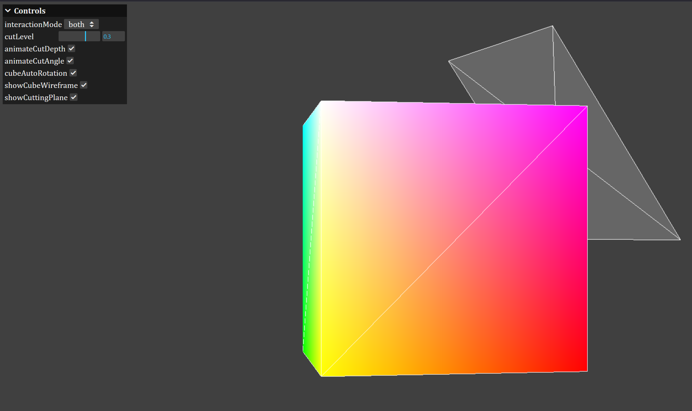

# colorcube

A cube color picker. It has varying intensities of Red, Green and Blue colors on each of its axis. Colors inside the cube can be reached by cutting any of its 8 corners.



## Develop

- install bun if you haven't already

```sh
bun install
bun parcel src/colorcube.html
```
